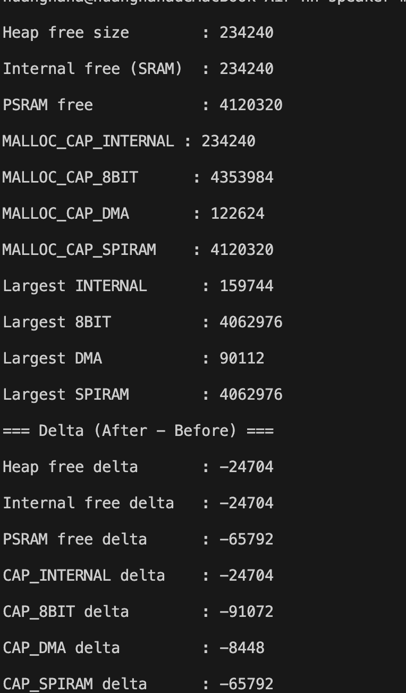

# Exercise 2 — ESP32 記憶體觀察與配置（實機量測版）

## 1. 作業目標

本作業透過 ESP32 記憶體 API，觀察不同記憶體能力（capabilities）在配置前後的變化，包含：

- Internal SRAM
- PSRAM
- DMA capable memory
- 各 capability 的剩餘空間與最大連續可用區塊

實作檔案為 [`firmware/src/main.cpp`](../../firmware/src/main.cpp)。

---

## 2. 實作內容

### Part 1：顯示記憶體資訊

使用下列 API 取得系統資源：

- `ESP.getHeapSize()`
- `ESP.getFreeHeap()`
- `heap_caps_get_free_size(MALLOC_CAP_INTERNAL)`
- `heap_caps_get_free_size(MALLOC_CAP_SPIRAM)`
- `heap_caps_get_largest_free_block(...)`

程式以 `MemorySnapshot` 結構統一保存數據，並由 `printMemoryStatus()` 輸出。對應實作可見 [`captureMemorySnapshot()`](../../firmware/src/main.cpp:45) 與 [`printMemoryStatus()`](../../firmware/src/main.cpp:69)。

### Part 2：配置不同類型記憶體

使用 [`heap_caps_malloc()`](../../firmware/src/main.cpp:107) 分配：

- Internal SRAM：16 KB（`MALLOC_CAP_INTERNAL | MALLOC_CAP_8BIT`）
- DMA memory：8 KB（`MALLOC_CAP_DMA | MALLOC_CAP_8BIT`）
- PSRAM：64 KB（`MALLOC_CAP_SPIRAM | MALLOC_CAP_8BIT`）

對應實作可見 [`allocateExerciseBuffers()`](../../firmware/src/main.cpp:105)。

### Part 3：觀察記憶體變化

流程由 [`runExercise2MemoryDemo()`](../../firmware/src/main.cpp:154) 控制：

1. 先擷取 Before snapshot
2. 執行配置
3. 擷取 After snapshot
4. 透過 [`printMemoryDelta()`](../../firmware/src/main.cpp:92) 輸出差異
5. 釋放配置（避免影響原專案後續功能）

---

## 3. 輸出

Serial 輸出已整理於 [`docs/exercise2/serial_output.txt`](./serial_output.txt)，內容為本次實機執行結果（非預測值）。

---

## 4. 記憶體差異分析

- **Internal SRAM**：速度快，適合低延遲與即時用途。
- **DMA memory**：可供周邊 DMA 直接存取，常用於 I2S/SPI/UART 緩衝。
- **PSRAM**：容量大但延遲較高，適合大型資料緩衝。
- **MALLOC_CAP_8BIT**：支援 byte-addressable，一般資料存取常用。

配置後可觀察到：

1. `free size` 下降（符合配置需求）。
2. `largest free block` 同步下降，代表連續可用空間減少。
3. 若持續做不規則大小分配/釋放，`largest free block` 可能下降更快，顯示 fragmentation 風險上升。

---

## 5. 結論

本作業完成了：

- 記憶體資訊顯示（含 capability）
- 使用 [`heap_caps_malloc()`](../../firmware/src/main.cpp:107) 進行多類型配置
- Before/After/Delta 比較與觀察

建議實務上持續監控 `free size` 與 `largest free block`，並將大容量緩衝優先放置於 PSRAM，保留 Internal SRAM 給即時與關鍵任務。

