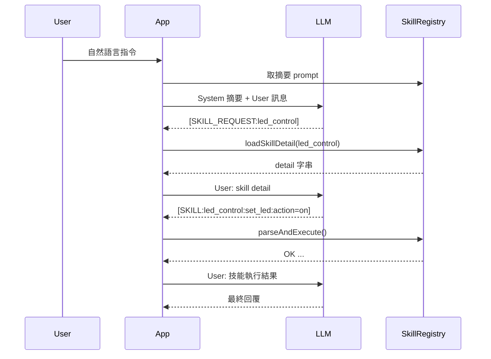

# Skill System 漸進式載入設計

> **版本**: 0.2.0（設計稿）  
> **日期**: 2026-04-03  
> **範疇**: 韌體端 Skill System 的兩階段提示詞與按需載入設計

---

## 1. 目標與核心概念

**目標**：在不改變現有 `[SKILL:...]` 執行格式的前提下，將 system prompt 由「全量詳細」改為「摘要列表」，並引入 **按需載入 detail** 的二段式互動流程，以降低 prompt size 與記憶體佔用，同時減少 LLM 往返。

**核心概念**：

- **摘要層（Summary Layer）**：啟動時僅載入必要的 frontmatter 欄位（name/version/description/commands 摘要），用於第一階段 system prompt。
- **詳細層（Detail Layer）**：當 LLM 判定需要某 skill 時，以 `[SKILL_REQUEST:skill_name]` 提出請求，韌體回傳該 skill 的完整 detail（parameters/commands/format/body），再進入命令生成。

---

## 2. 兩階段 Prompt 流程與時序

### 2.1 第一階段（摘要提示 → 決策）

1. **開機載入摘要**：`SkillRegistry::scanDirectory()` 僅解析 frontmatter 最小集合（summary-only）。
2. **生成摘要 prompt**：`SkillRegistry::generateSystemPromptSummary()` 只輸出 `generateSummary()` 的結果。
3. **LLM 回覆**：
   - 若已能選擇 skill 並補齊參數 → 直接輸出 `[SKILL:...]`。
   - 若需要更多細節 → 輸出 `[SKILL_REQUEST:skill_name]`。

### 2.2 第二階段（detail 提供 → 執行）

1. **韌體解析 request**：`SkillRegistry::parseSkillRequest()` 偵測 `[SKILL_REQUEST:...]`。
2. **按需載入 detail**：`SkillRegistry::loadSkillDetail(skill_name)` 讀取完整 SKILL.md（含 body）。
3. **回饋給 LLM**：以 user message 形式提供 detail（含 parameters/commands/format/body）。
4. **LLM 產生執行 tag**：輸出 `[SKILL:skill_name:command:...]`。
5. **韌體解析與執行**：沿用現有 `parseAndExecute()`。

### 2.3 對話時序圖



---

## 3. LLM 協議格式

### 3.1 詳細資訊索取

新增格式：

```
[SKILL_REQUEST:skill_name]
```

規則：

- `skill_name` 必須是摘要清單中的名稱。
- 若需要多個 skill，允許多行 request；韌體可一次回傳多個 detail。
- 只在缺乏 detail 時使用，不可用於最終執行。

### 3.2 執行格式（不變）

```
[SKILL:skill_name:command_name:param1=val1,param2=val2]
```

---

## 4. SkillRegistry 介面變更

### 4.1 Summary-only 與 Detail 管理

新增概念：`Skill` 具有「摘要已載入 / detail 已載入」狀態。

建議介面：

- `scanDirectory()` → 只載入 frontmatter（summary-only）
- `String generateSystemPromptSummary()` → 只輸出 summary
- `bool loadSkillDetail(const String &name)` → 需要時才載入完整 SKILL.md
- `String getSkillDetailPrompt(const String &name)` → 回傳 detail prompt
- `bool parseSkillRequest(const String &reply, std::vector<String> &skills)` → 解析 LLM 要求

### 4.2 Skill 內容結構

建議補充欄位：

- `bool summaryLoaded`
- `bool detailLoaded`
- `String sourcePath`（SKILL.md 路徑，供按需載入）

摘要載入時只填 `name/version/description/commands`（必要欄位），detail 載入時再補 `parameters/body/format`。

---

## 5. OpenAILLM 介面變更

### 5.1 chatV3 的兩階段處理

現有 `chatV3()` 流程需加入：

1. **Skill request 偵測**：在 `parseAndExecute()` 前，先偵測 `[SKILL_REQUEST:...]`。
2. **回饋 detail**：若偵測到 request，從 registry 取得 detail，透過下一輪 user message 注入。
3. **限制迭代次數**：避免無限來回，仍沿用 `maxIterations`。

### 5.2 Prompt 組合策略

調整 `combinedPrompt` 組合：

- 使用 `generateSystemPromptSummary()` 取代 `generateSystemPrompt()`。
- 在 system prompt 中加註規則：**先 request detail，再輸出 `[SKILL:...]`**。

---

## 6. 記憶體最佳化策略

1. **摘要常駐**：只保留 summary 欄位，避免 body 佔用 RAM。
2. **detail 延遲載入**：只有被 request 的 skill 才載入 body/parameters。
3. **detail LRU 快取（可選）**：可設置最大 detail 數量，超出後釋放最舊 detail。
4. **分段拼接 prompt**：避免一次性建立超大字串；可分段 append。
5. **限制 detail 長度（可選）**：對 body 做截斷或摘要（例如最多 N 字元）。

---

## 7. ARCHITECTURE.md 更新建議

### 7.1 新增「韌體端兩階段流程」章節

補充與 Python loader 對應的韌體流程：

- Summary-only 初始化
- `[SKILL_REQUEST:...]` 的 LLM 協議
- Detail on-demand 載入

### 7.2 更新 SkillRegistry 章節

新增韌體端 SkillRegistry 方法：

- `generateSystemPromptSummary()`
- `loadSkillDetail()`
- `parseSkillRequest()`

### 7.3 更新對話時序圖

加入 LLM 觸發 request → detail 回饋 → 產生 `[SKILL:...]` 的兩階段流程。

---

## 8. 相容性說明

- **執行 tag 不變**：現有 `[SKILL:...]` 解析邏輯可維持。
- **技能資料來源不變**：仍使用 `data/skills/<name>/SKILL.md`。
- **舊模型可回退**：若不支援 request，可保留「全量模式」的 fallback。 

